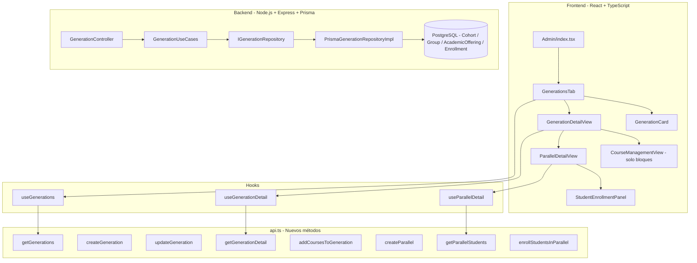
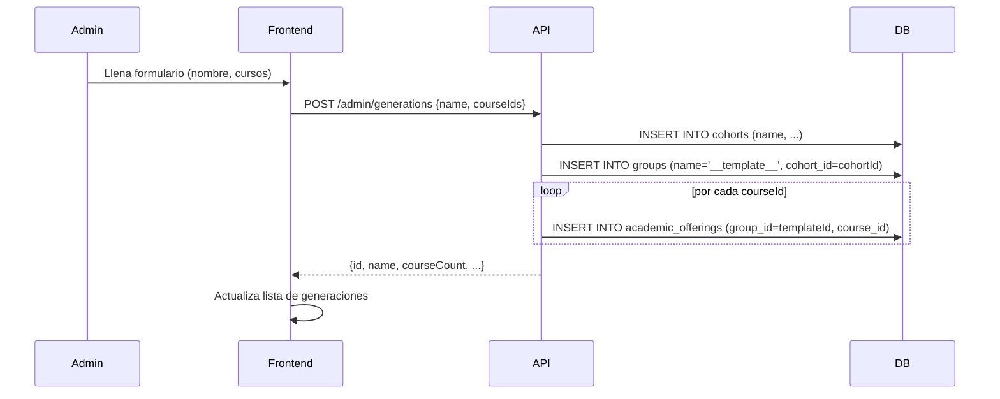
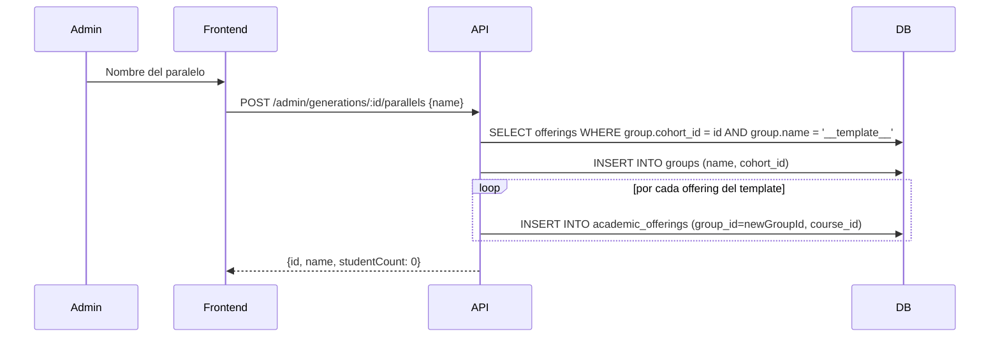
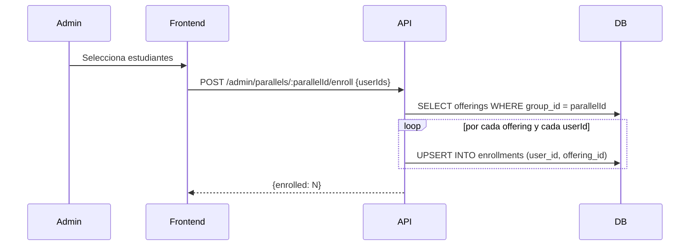

# Diseño Técnico: generation-course-management

## Overview

Este documento describe el diseño técnico para el rediseño del tab "Gestión de Cursos" en el panel de administración del LMS Clearminds. El cambio central es introducir **Generaciones** (mapeadas al modelo `Cohort`) como unidad organizativa de primer nivel, desde la cual se gestionan cursos, bloques/temas y paralelos (grupos de estudiantes).

El flujo de navegación principal es:

```
Tab "Gestión de Cursos"
  └── Lista de Generaciones (GenerationsTab)
        └── Detalle de Generación (GenerationDetailView)
              ├── Cursos asignados → Detalle de Curso (CourseManagementView - solo bloques)
              └── Paralelos → Detalle de Paralelo (ParallelDetailView - estudiantes)
```

El tab `blocks` en el sidebar conserva únicamente la gestión de contenido de cursos (bloques/temas), eliminando la sub-pestaña "Gestión de Paralelos".

---

## Architecture

La arquitectura sigue el patrón hexagonal existente en el backend y el patrón de componentes React con hooks personalizados en el frontend.



### Decisiones de diseño

1. **Reutilización de `CourseManagementView`**: El componente existente se adapta para recibir un prop `hideParallelsTab` que oculta la sub-pestaña "Paralelos" cuando se usa dentro del contexto de una generación. La gestión de paralelos vive en `GenerationDetailView`.

2. **Nuevo controlador `GenerationController`**: Se crea un controlador dedicado en lugar de extender `GroupController`, para mantener separación de responsabilidades. Los endpoints de generación se registran bajo `/api/admin/generations`.

3. **Creación automática de offerings al crear paralelo**: Cuando se crea un paralelo dentro de una generación que ya tiene cursos asignados, el backend crea automáticamente las `AcademicOffering` correspondientes (Req. 6.5).

4. **Unicidad de nombre de generación**: El modelo `Cohort` ya tiene `@unique` en `name`, por lo que el backend retorna 409 naturalmente si Prisma lanza `P2002`.

---

## Components and Interfaces

### Frontend - Nuevos componentes

#### `GenerationsTab`
Reemplaza `CoursesTab` cuando `activeTab === 'courses'`. Muestra la lista de generaciones o estado vacío.

```typescript
interface GenerationsTabProps {
  onSelectGeneration: (generation: Generation) => void;
}
```

#### `GenerationCard`
Tarjeta individual para cada generación en la lista.

```typescript
interface GenerationCardProps {
  generation: Generation;
  onClick: () => void;
}
```

#### `GenerationDetailView`
Vista de detalle de una generación. Contiene dos sub-secciones: Cursos y Paralelos.

```typescript
interface GenerationDetailViewProps {
  generation: Generation;
  onBack: () => void;
  onManageBlocks: (course: CourseData) => void;
}
```

#### `ParallelDetailView`
Vista de detalle de un paralelo: lista de estudiantes inscritos y panel de asignación.

```typescript
interface ParallelDetailViewProps {
  parallel: Parallel;
  generationId: string;
  onBack: () => void;
}
```

#### `CourseManagementView` (modificación)
Se agrega el prop `hideParallelsTab?: boolean` para ocultar la sub-pestaña "Paralelos" cuando se usa desde el contexto de generación.

```typescript
interface CourseManagementViewProps {
  course: CourseData;
  onBack: () => void;
  hideParallelsTab?: boolean; // nuevo
}
```

### Frontend - Tipos de dominio

```typescript
interface Generation {
  id: string;
  name: string;
  description?: string;
  startDate?: string;
  endDate?: string;
  status: 'active' | 'inactive';
  courseCount: number;
  parallelCount: number;
}

interface GenerationDetail extends Generation {
  courses: CourseInGeneration[];
  parallels: Parallel[];
}

interface CourseInGeneration {
  offeringId: string;
  course: CourseData;
}

interface Parallel {
  id: string;
  name: string;
  status: string;
  studentCount: number;
  cohortId: string;
}

interface ParallelDetail extends Parallel {
  students: EnrolledStudent[];
  offerings: OfferingInParallel[];
}

interface EnrolledStudent {
  id: string;
  fullName: string;
  email: string;
  enrolledAt: string;
}

interface OfferingInParallel {
  id: string;
  courseId: string;
  courseName: string;
}
```

### Frontend - Hooks personalizados

#### `useGenerations`
```typescript
// Gestiona la lista de generaciones
function useGenerations(): {
  generations: Generation[];
  isLoading: boolean;
  error: string | null;
  refetch: () => void;
  createGeneration: (data: CreateGenerationPayload) => Promise<Generation>;
  updateGeneration: (id: string, data: UpdateGenerationPayload) => Promise<Generation>;
}
```

#### `useGenerationDetail`
```typescript
// Gestiona el detalle de una generación (cursos + paralelos)
function useGenerationDetail(generationId: string): {
  detail: GenerationDetail | null;
  isLoading: boolean;
  addCourses: (courseIds: string[]) => Promise<void>;
  createParallel: (name: string) => Promise<Parallel>;
  refetch: () => void;
}
```

#### `useParallelDetail`
```typescript
// Gestiona el detalle de un paralelo (estudiantes)
function useParallelDetail(parallelId: string): {
  detail: ParallelDetail | null;
  isLoading: boolean;
  enrollStudents: (userIds: string[]) => Promise<void>;
  refetch: () => void;
}
```

### Backend - Nuevos endpoints

#### `GenerationController`

| Método | Ruta | Descripción |
|--------|------|-------------|
| GET | `/api/admin/generations` | Lista todas las generaciones con conteos |
| POST | `/api/admin/generations` | Crea una generación (con cursos opcionales) |
| GET | `/api/admin/generations/:id` | Detalle: cursos + paralelos |
| PATCH | `/api/admin/generations/:id` | Actualiza nombre, descripción, fechas, estado |
| POST | `/api/admin/generations/:id/courses` | Agrega cursos a una generación existente |
| GET | `/api/admin/generations/:id/parallels` | Lista paralelos de una generación |
| POST | `/api/admin/generations/:id/parallels` | Crea un paralelo dentro de la generación |
| GET | `/api/admin/parallels/:parallelId/students` | Lista estudiantes de un paralelo |
| POST | `/api/admin/parallels/:parallelId/enroll` | Inscribe estudiantes en un paralelo |

#### Payloads de request/response

```typescript
// POST /api/admin/generations
interface CreateGenerationPayload {
  name: string;           // requerido, único
  description?: string;
  startDate?: string;     // ISO date
  endDate?: string;       // ISO date
  courseIds?: string[];   // cursos iniciales opcionales
}

// PATCH /api/admin/generations/:id
interface UpdateGenerationPayload {
  name?: string;
  description?: string;
  startDate?: string;
  endDate?: string;
  status?: 'active' | 'inactive';
}

// POST /api/admin/generations/:id/courses
interface AddCoursesPayload {
  courseIds: string[];
}

// POST /api/admin/generations/:id/parallels
interface CreateParallelPayload {
  name: string;  // único dentro de la generación
}

// POST /api/admin/parallels/:parallelId/enroll
interface EnrollStudentsPayload {
  userIds: string[];
}

// GET /api/admin/generations - Response item
interface GenerationListItem {
  id: string;
  name: string;
  description?: string;
  startDate?: string;
  endDate?: string;
  status: string;
  courseCount: number;
  parallelCount: number;
}

// GET /api/admin/generations/:id - Response
interface GenerationDetailResponse {
  id: string;
  name: string;
  description?: string;
  startDate?: string;
  endDate?: string;
  status: string;
  courses: Array<{
    offeringId: string;
    course: { id: string; name: string; description?: string; status: string; imageUrl?: string; blocks: any[] }
  }>;
  parallels: Array<{
    id: string;
    name: string;
    status: string;
    studentCount: number;
  }>;
}
```

---

## Data Models

Los modelos de Prisma existentes cubren todos los casos de uso. No se requieren migraciones de schema.

### Mapeo conceptual → Prisma

| Concepto | Modelo Prisma | Notas |
|----------|--------------|-------|
| Generación | `Cohort` | `name` ya es `@unique`. Se usan `description`, `start_date`, `end_date`, `status` |
| Paralelo | `Group` | Se vincula a `Cohort` via `cohort_id`. El campo `cohort` (string legacy) se setea igual al nombre del cohort |
| Curso en Generación | `AcademicOffering` | `group_id` apunta al paralelo; para la relación generación→curso se usa un `Group` "virtual" o se consulta via los grupos de la generación |
| Estudiante en Paralelo | `Enrollment` | Una entrada por cada `AcademicOffering` del paralelo |

### Nota sobre la relación Generación → Cursos

El schema actual no tiene una tabla directa `cohort_courses`. La relación se infiere a través de los `AcademicOffering` de los `Group` que pertenecen al `Cohort`. Para la vista de "cursos de una generación", el backend consulta los cursos únicos a través de los offerings de todos los grupos del cohort.

Para el caso de creación de generación con cursos iniciales (sin paralelos aún), se crea un `Group` interno de tipo "template" con nombre `__template__` vinculado al cohort, que almacena los cursos asignados. Cuando se crea el primer paralelo real, sus offerings se crean a partir de este template.

**Alternativa más limpia (recomendada)**: Agregar una tabla `cohort_courses` en una migración futura. Para esta iteración, el backend mantiene la lista de cursos de una generación consultando los `AcademicOffering` del grupo template o de cualquier grupo del cohort (deduplicando por `course_id`).

### Flujo de datos: Crear Generación con cursos



### Flujo de datos: Crear Paralelo



### Flujo de datos: Inscribir estudiantes en paralelo



---

## Correctness Properties

*A property is a characteristic or behavior that should hold true across all valid executions of a system — essentially, a formal statement about what the system should do. Properties serve as the bridge between human-readable specifications and machine-verifiable correctness guarantees.*

### Property 1: Unicidad de nombre de generación

*Para cualquier* conjunto de generaciones en el sistema, no pueden existir dos generaciones con el mismo nombre. Si se intenta crear una generación con un nombre ya existente, la operación debe fallar con HTTP 409.

**Validates: Requirements 2.6**

### Property 2: Validación de rango de fechas

*Para cualquier* par de fechas (startDate, endDate) enviadas al crear o editar una generación, si endDate es anterior a startDate, la API debe rechazar la operación con HTTP 400.

**Validates: Requirements 2.4**

### Property 3: Idempotencia de asignación de cursos

*Para cualquier* generación y cualquier conjunto de courseIds, asignar los mismos cursos múltiples veces debe producir el mismo resultado que asignarlos una sola vez — sin duplicados en los offerings.

**Validates: Requirements 3.3**

### Property 4: Unicidad de nombre de paralelo dentro de generación

*Para cualquier* generación, no pueden existir dos paralelos con el mismo nombre dentro de esa generación. Si se intenta crear un paralelo con nombre duplicado en la misma generación, la API debe retornar HTTP 409.

**Validates: Requirements 6.3**

### Property 5: Creación automática de offerings al crear paralelo

*Para cualquier* generación con N cursos asignados, al crear un nuevo paralelo dentro de esa generación, el paralelo debe tener exactamente N `AcademicOffering` creados automáticamente — uno por cada curso de la generación.

**Validates: Requirements 6.5**

### Property 6: Idempotencia de inscripción de estudiantes

*Para cualquier* paralelo y cualquier conjunto de userIds, inscribir los mismos estudiantes múltiples veces debe producir el mismo estado final — sin duplicados en enrollments, sin errores.

**Validates: Requirements 7.3**

### Property 7: Estado vacío puro — sin datos precargados

*Para cualquier* generación recién creada, la lista de cursos y la lista de paralelos deben estar vacías (longitud 0) si no se enviaron courseIds en la creación.

**Validates: Requirements 11.4, 11.5, 11.6**

### Property 8: Cambio de estado no afecta inscripciones

*Para cualquier* generación con estudiantes inscritos, cambiar el estado de la generación a "inactiva" no debe modificar ni eliminar ningún registro de `Enrollment` existente.

**Validates: Requirements 8.2**

---

## Error Handling

### Backend

| Escenario | HTTP Status | Mensaje |
|-----------|-------------|---------|
| Nombre de generación duplicado | 409 | `"Ya existe una generación con ese nombre"` |
| Nombre de paralelo duplicado en generación | 409 | `"Ya existe un paralelo con ese nombre en esta generación"` |
| endDate < startDate | 400 | `"La fecha de fin debe ser posterior a la fecha de inicio"` |
| Nombre de generación vacío | 400 | `"El nombre de la generación es requerido"` |
| Nombre de paralelo vacío | 400 | `"El nombre del paralelo es requerido"` |
| Generación no encontrada | 404 | `"Generación no encontrada"` |
| Paralelo no encontrado | 404 | `"Paralelo no encontrado"` |
| Error interno | 500 | `"Error interno del servidor"` |

El backend captura `PrismaClientKnownRequestError` con código `P2002` (unique constraint) y lo convierte en HTTP 409.

### Frontend

- Todos los formularios deshabilitan el botón de submit mientras `saving === true` y muestran un spinner.
- Los errores de API se muestran como mensajes inline junto al campo correspondiente (cuando el servidor los identifica) o como toast/alert global.
- Los errores de red (sin respuesta del servidor) muestran un mensaje genérico sin colapsar la UI.
- Las listas en estado de carga muestran un spinner centrado.
- Las listas vacías muestran un `EmptyState` con ícono, mensaje descriptivo y botón de acción.

---

## Testing Strategy

### Unit Tests

Se escriben para:
- Lógica de validación de fechas en el backend (startDate < endDate)
- Lógica de deduplicación de courseIds antes de crear offerings
- Función de mapeo de respuesta Prisma → DTO de generación
- Componentes React: renderizado de `EmptyState` cuando la lista está vacía

### Property-Based Tests

Se usa **fast-check** (frontend/backend TypeScript) para los tests de propiedades.

Cada test corre mínimo **100 iteraciones**.

Formato de tag: `Feature: generation-course-management, Property {N}: {texto}`

#### Property 1: Unicidad de nombre de generación
```
// Feature: generation-course-management, Property 1: Unicidad de nombre de generación
// Para cualquier nombre de generación, crear dos generaciones con el mismo nombre
// debe resultar en error 409 en la segunda creación.
fc.property(fc.string({ minLength: 1 }), async (name) => {
  await createGeneration({ name });
  const result = await createGeneration({ name });
  expect(result.status).toBe(409);
})
```

#### Property 2: Validación de rango de fechas
```
// Feature: generation-course-management, Property 2: Validación de rango de fechas
// Para cualquier par de fechas donde endDate < startDate, la API debe retornar 400.
fc.property(
  fc.date(),
  fc.nat({ max: 365 }),
  async (endDate, daysBack) => {
    const startDate = new Date(endDate.getTime() + (daysBack + 1) * 86400000);
    const result = await createGeneration({ name: uuid(), startDate, endDate });
    expect(result.status).toBe(400);
  }
)
```

#### Property 3: Idempotencia de asignación de cursos
```
// Feature: generation-course-management, Property 3: Idempotencia de asignación de cursos
// Para cualquier generación y lista de courseIds, asignar los mismos cursos dos veces
// produce el mismo número de offerings que asignarlos una vez.
fc.property(fc.array(fc.uuid(), { minLength: 1, maxLength: 5 }), async (courseIds) => {
  const gen = await createGeneration({ name: uuid() });
  await addCourses(gen.id, courseIds);
  await addCourses(gen.id, courseIds); // segunda vez
  const detail = await getGenerationDetail(gen.id);
  expect(detail.courses.length).toBe(new Set(courseIds).size);
})
```

#### Property 4: Unicidad de nombre de paralelo dentro de generación
```
// Feature: generation-course-management, Property 4: Unicidad de nombre de paralelo
fc.property(fc.string({ minLength: 1 }), async (parallelName) => {
  const gen = await createGeneration({ name: uuid() });
  await createParallel(gen.id, parallelName);
  const result = await createParallel(gen.id, parallelName);
  expect(result.status).toBe(409);
})
```

#### Property 5: Creación automática de offerings al crear paralelo
```
// Feature: generation-course-management, Property 5: Creación automática de offerings
fc.property(fc.array(fc.uuid(), { minLength: 1, maxLength: 5 }), async (courseIds) => {
  const gen = await createGeneration({ name: uuid(), courseIds });
  const parallel = await createParallel(gen.id, 'Paralelo A');
  const offerings = await getParallelOfferings(parallel.id);
  expect(offerings.length).toBe(courseIds.length);
})
```

#### Property 6: Idempotencia de inscripción de estudiantes
```
// Feature: generation-course-management, Property 6: Idempotencia de inscripción
fc.property(fc.array(fc.uuid(), { minLength: 1, maxLength: 10 }), async (userIds) => {
  const { parallelId } = await setupParallelWithCourse();
  await enrollStudents(parallelId, userIds);
  await enrollStudents(parallelId, userIds); // segunda vez
  const students = await getParallelStudents(parallelId);
  expect(students.length).toBe(new Set(userIds).size);
})
```

#### Property 7: Estado vacío puro
```
// Feature: generation-course-management, Property 7: Estado vacío puro
fc.property(fc.string({ minLength: 1 }), async (name) => {
  const gen = await createGeneration({ name });
  const detail = await getGenerationDetail(gen.id);
  expect(detail.courses.length).toBe(0);
  expect(detail.parallels.length).toBe(0);
})
```

#### Property 8: Cambio de estado no afecta inscripciones
```
// Feature: generation-course-management, Property 8: Estado no afecta inscripciones
fc.property(fc.array(fc.uuid(), { minLength: 1, maxLength: 5 }), async (userIds) => {
  const { genId, parallelId } = await setupGenerationWithStudents(userIds);
  const enrollmentsBefore = await getEnrollmentCount(parallelId);
  await updateGeneration(genId, { status: 'inactive' });
  const enrollmentsAfter = await getEnrollmentCount(parallelId);
  expect(enrollmentsAfter).toBe(enrollmentsBefore);
})
```
